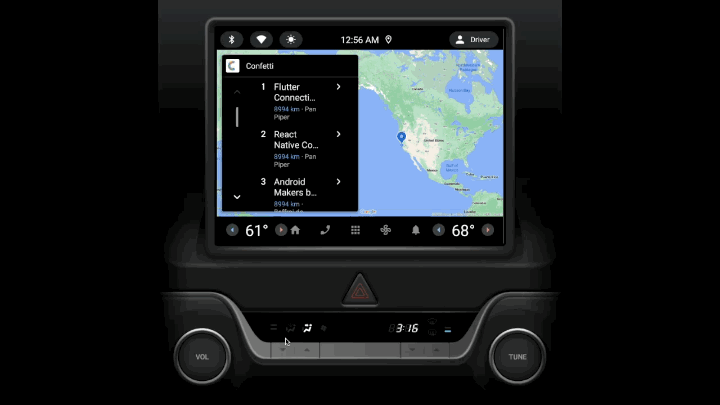

# Confetti 🎊

Kotlin Multiplatform GraphQL project (backend and clients) to allow viewing of conference information for a range of conferences.

Includes:

- SwiftUI iOS client
- Jetpack Compose Android client
- Compose for Desktop client (early version)
- Compose for Wear OS client (contributed by https://github.com/yschimke)
- Compose for iOS (session details screen shared across platforms)
- Android Auto and Automotive OS (contributed by https://github.com/cmota)
- [Apollo GraphQL](https://github.com/apollographql/apollo-kotlin) based Kotlin Multiplatform shared
  code
- GraphQL backend

### Contributors

### Related posts

* [Swift/Kotlin ViewModel alignment in a Kotlin Multiplatform project](https://johnoreilly.dev/posts/swift-kotlin-viewmodel-kmm-comparison/)
* [Using KMM-ViewModel library to share VM between iOS and Android](https://johnoreilly.dev/posts/kmm-viewmodel/)
* [Consuming Compose for iOS in a SwiftUI application](https://johnoreilly.dev/posts/swiftui-compose-ios/)

### Building

Use Android Studio/IntelliJ to build/run Android client.
Requires Xcode 14 or later for iOS client.

### Screenshots

### Gemini functionality

Gemini based talk recommendations for particuar conference are included in the mobile clients (if `gemini_api_key` configured in `local.properties`).  Desktop client allows free entry of query.

### API

The API is available at https://confetti-app.dev/graphiql
You can query the list of conferences with `conferences.id` and chose what conference to query by
passing a `"conference"` HTTP header 

